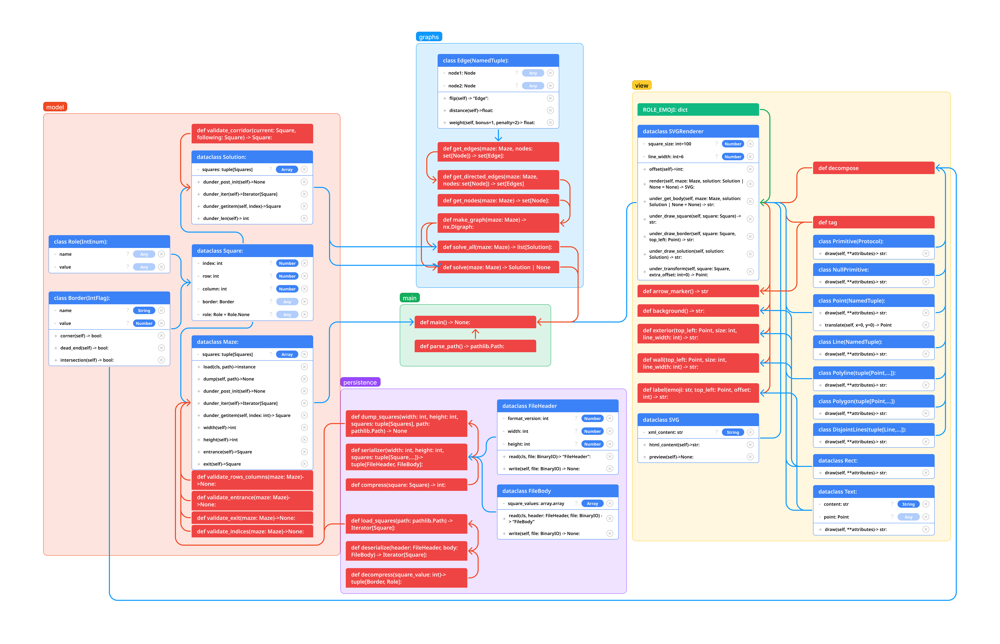

# a-maze-ing: 

## README Contents:
1. Description
1. Authors
1. Installation
1. Requirements
1. Tests
1. Usage
1. File Structure
1. Domain Model

## External README Contents
- [ ] Delete these files after midterm to prepare for project for resume and delete this TODO.

1. [Team Agreement](team_agreement.md)
1. [Project Ideas](project_ideas.md)
1. [Project Design](project_design.md)
1. [Requirements](requirements.md)

## Description:
- [ ] Update description once finished with midterm and delete this TODO.

This is a command-line interface to create and solve mazes. A client will be able to generate new mazes and save them as binary files and/or images. The client will also be able to generate a solution for a maze and save its image and/or video.

## Authors:
KP Gomez

Jacob Bassett

## Installation:
- [ ] Update installation once finished with midterm and delete this TODO.

Run the following command in the terminal to clone this repository to your local environment.
```bash
git clone https://github.com/amazing-maze-solver/a-maze-ing.git
cd a-maze-ing
python3 -m venv .venv
# source .venv/bin/activate for macOS
# .venv\Scripts\activate for windows
```

## Requirements:
- [ ] Update list of requirements at end of midterm and delete this TODO.

Run the following command in the terminal to install all requirements.

```bash
pip install -r requirements.txt
```
These are the required software you will be installing into your virtual environment.
* cairocffi==1.6.1
* CairoSVG==2.7.1
* imageio==2.33.0
* networkx==3.2.1
* pytest==7.4.3

## Tests:
- [ ] Update tests at end of midterm and delete this TODO.

Run the following command in the terminal to run all tests.
```bash
pytest
```
## Usage:
- [ ] Update usage at end of midterm and delete this TODO.

Run the following command in the terminal to start the application.
```bash
python3 main.py
```

## File Structure:
- [ ] Update tree by end of midterm and delete this TODO.

```bash
.
├── requirements.txt
└── src
    ├── maze_solver
    ├── __init__.py
    ├── __main__.py
    ├── graphs
    │   ├── __init__.py
    │   ├── converter.py
    │   └── solver.py
    ├── models
    │   ├── __init__.py
    │   ├── border.py
    │   ├── maze.py
    │   ├── role.py
    │   ├── solution.py
    │   └── square.py
    ├── persistence
    │   ├── __init__.py
    │   ├── file_format.py
    │   └── serializer.py
    └── view
        ├── __init__.py
        ├── decomposer.py
        ├── primitives.py
        └── renderer.py
```

## Domain Model:
- [ ] Add stretch goals to domain model and delete this TODO

This is the basic domain model from the tutorial. 
We will be recreating a version of this and adding new features like generating new mazes and converting the solution into a movie.

